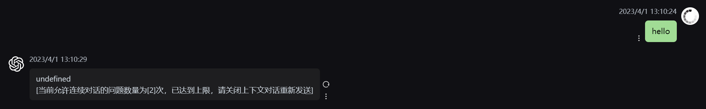
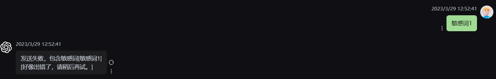
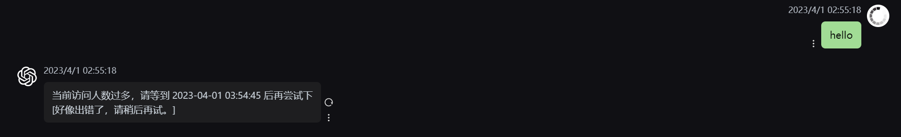
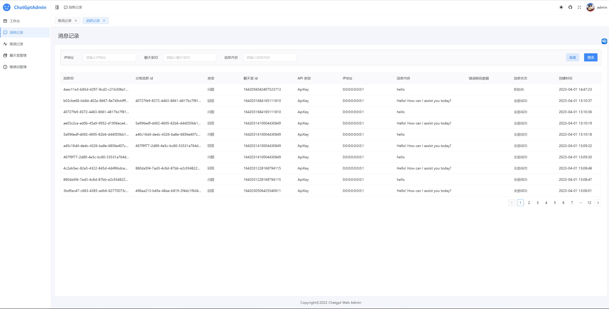
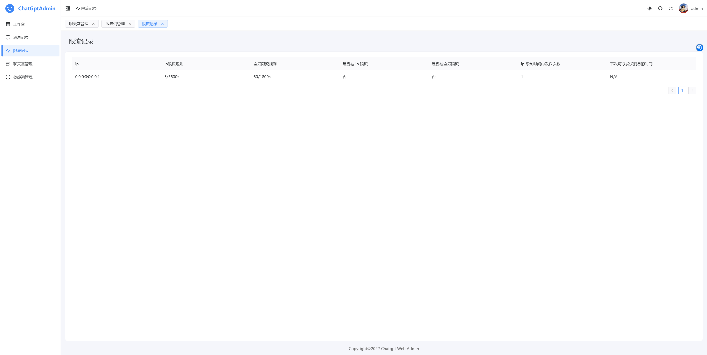
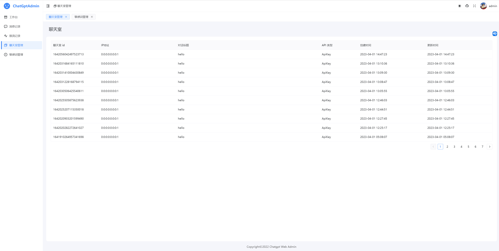
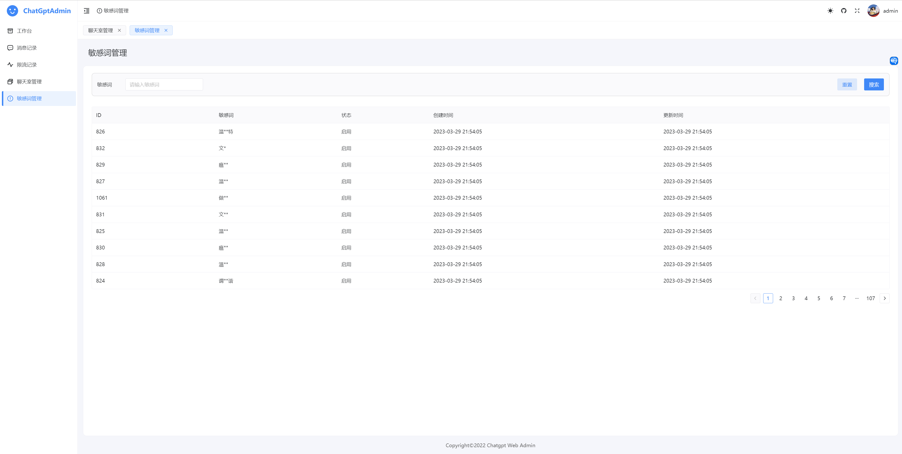
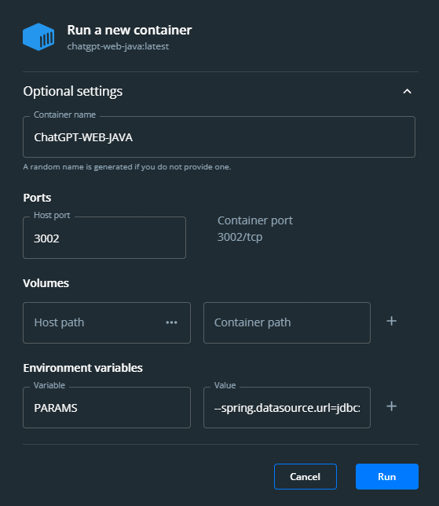

# chatgpt-web-java

[Chinese Version](README.md) | English

# Introduction

- Java backend for the [Chanzhaoyu/chatgpt-web](https://github.com/Chanzhaoyu/chatgpt-web) project, latest code in the main branch
- This branch is associated with version [2.10.8](https://github.com/Chanzhaoyu/chatgpt-web/releases/tag/v2.10.8) of the project, updating the backend without modifying the frontend
- Open-source admin code: https://github.com/hncboy/chatgpt-web-admin

# Notice

## About Asking Questions

If you have questions, please check the documentation and issues first, as you may find a solution to your problem already exists. If not, feel free to open a new issue.

## About ApiKey

The current website allows free questions, but due to limited ApiKey quota, the rate limiting might be high. We would be very grateful if anyone could sponsor an ApiKey for the website.

# Framework

- Spring Boot 2.7.10
- JDK 17
- MySQL 8.x
- SpringDoc API Documentation
- MyBatis Plus
- MapStruct
- Lombok
- [Hutool](https://hutool.cn/) 
- [SaToken](https://sa-token.cc/) Authentication
- [Grt1228 ChatGPT java sdk](https://github.com/Grt1228/chatgpt-java)

# URLs

- API Documentation: http://localhost:3002/swagger-ui.html
- Client: https://front.stargpt.top/ Password: stargpt
- Admin: https://admin.stargpt.top/ Username & Password: admin-admin

# Features

## Implemented Features

### Contextual Chat

Contextual chat using ApiKey is implemented through MySQL for storing chat data. AccessToken supports contextual chat by default. The number of contextual questions can be limited by configuring the limitQuestionContextCount parameter.

The database stores the records of each chat session. When selecting contextual chat, the history is obtained by recursively traversing the parentMessageId to get historical messages, sending both historical questions and answers to GPT.



### Sensitive Word Filtering

Sensitive words from the sensitive_word_base64.txt file are imported into the sensitive words table at project startup. Currently, there is no backend management interface for sensitive words; once provided, this method can be removed. Sensitive words are stored in base64 format in the file. The data from the sensitive words table is built into the WordTree class provided by HuTool. When sending a message, call the method to check if it belongs to sensitive words; if yes, the message will not be sent successfully. To maintain the frontend context, in case the message content is a sensitive word, a normal message format is returned with the requested conversationI and parentMessagId.



### Rate Limiting

Global and IP-based rate limiting are implemented using memory and double-ended queues for sliding window rate limiting. During the rate-limiting process, data is written asynchronously to a file. When the project restarts, the file is read to restore the rate-limiting state.

Configure maxRequest, maxRequestSecond, ipMaxRequest, and ipMaxRequestSecond in the configuration file.



## Features to be Implemented

- Specific encapsulation of GPT API exception information returns
- Other undiscovered points

## Existing Issues

- When the API returns an error message, it does not include the conversationid and parentMessageId, causing the frontend to lose these two fields when sending a message next time, losing the context relationship.

# Admin

## Message Records

Displays the message list, where questions and answers are separate messages. Parent messages are linked through parent message id. Parent messages and current messages must belong to the same chat room.



## Rate Limit Records

View rate limit records for different IPs. Only rate limits within the rate limiting time range are recorded.



## Chat Room Management

View chat rooms. The chat room concept here is different from the conversations on the left side of the client. In the same window, we can choose to send messages with or without context association. If context association is not selected, each message sent will create a new chat room.



## Sensitive Word Management

View the list of sensitive words. Currently, only search functionality is provided. Management features can be added later.



# Running and Deployment

## Running with IDEA

Run the frontend code using WebStorm, Vs Code, or pnpm install & dev. Run the backend with IDEA.

## Docker

Clone the repository and execute the following commands in the root directory:

### MySQL

Build a Docker image containing the database structure using Dockerfile_mysql and run it. If you have a local MySQL, you can skip this step.

```shell
  # Remove old container (if any)
  docker stop mysql_gpt && docker rm mysql_gpt
  # Build image
  docker build -t mysql_gpt_img:latest . -f Dockerfile_mysql
  # Run container
  docker run -d -p 3309:3306 \
       --name mysql_gpt \
       -v ~/mydata/mysql_dummy/data:/var/lib/mysql \
       -v  ~/mydata/mysql_dummy/conf:/etc/mysql/conf.d \
       -v ~/mydata/mysql_dummy/log:/var/log/mysql \
       mysql_gpt_img:latest
```

### Java

Build and run the Java application image with Docker

```shell
  # Remove old container (if any)
  docker stop chatgpt-web-java && docker rm chatgpt-web-java
  docker build -t chatgpt-web-java .
  docker run -d -p 3002:3002 chatgpt-web-java
```

To explicitly specify parameters, add the `-e` option after `docker run`, and configure the parameters used in `application.yml`. For example:

```shell
  # Remove old container (if any)
  docker stop chatgpt-web-java && docker rm chatgpt-web-java
  docker build -t chatgpt-web-java . 
  # If you want to use the Java container to access the MySQL container here, you need to use host.docker.internal instead of localhost, to access the host's 3009 port (MySQL has opened the 3009 port)
  docker run -d -p 3002:3002 \
      -e JDBC_URL=jdbc:mysql://host.docker.internal:3309/chat?useUnicode=true&characterEncoding=UTF-8&autoReconnect=true&serverTimezone=Asia/Shanghai \
      -e MYSQL_USER_NAME=root \
      -e MYSQL_PASSWORD=123456 \
      -e CHAT_OPENAI_API_KEY=xxx \
      -e CHAT_OPENAI_ACCESS_TOKEN=xxx \
      -e CHAT_OPENAI_API_BASE_URL=http://xxx.com \
      -e CHAT_HTTP_PROXY_HOST=127.0.0.1 \
      -e CHAT_HTTP_PROXY_PORT=7890 \
      chatgpt-web-java

```



## docker-compose

Configure the `docker-compose.yml` file, then use `docker-compose up -d` to start with one click.

# Database Tables

Table structure path: `chatgpt-bootstrap/src/main/resources/db`. If you don't need additional databases, you can connect to the H2 address and change the connection method.

- Chat room table
- Chat record table
- Sensitive word table

# Contact

Please follow the rules when joining the group and avoid discussing sensitive information.

<div style="display: flex; align-items: center; gap: 20px;">   <div style="text-align: center">          <p>WeChat Group</p>   </div> </div> <div style="display: flex; align-items: center; gap: 20px;">   <div style="text-align: center">          <p>631171246</p>   </div> </div>

 # Sponsorship

If you find the project helpful and your situation permits, consider giving a Star or a small sponsorship. Thank you for your support~

<div style="display: flex; align-items: center; gap: 20px;">   <div style="text-align: center">          <p>WeChat Pay</p>   </div>   <div style="text-align: center">          <p>Alipay</p>   </div> </div>

# LICENSE

MIT © [hncboy](LICENSE)