# ai-beehive

# 介绍

- chatgpt-web-java 2.0 版本，更名为 ai-beehive（爱蜂巢、AI 蜂巢），体验站：https://front.aibeehive.icu
- chatgpt-web-java 1.0 [最终版分支地址](https://github.com/hncboy/chatgpt-web-java/tree/v1.1.0)，体验地址：https://front3.stargpt.top/#/
- 前端开发：https://github.com/mjjh1717
- 前端项目地址：https://github.com/mjjh1717/chatgpt-shuowen
- 描述：ai-beehive 项目的名字取自蜂巢，这源于我们构建房间的方式，即通过图纸塑造出独特的模块化房间，每个房间都是一个具有个性的聊天室，类似于蜂巢中的单独蜂窝。六边形的蜂窝设计启示我们，系统具有无限的扩展能力。在我们的 ai-beehive项目中，我们提供了一种方式，即通过添加新的图纸来扩展和丰富房间类型.

# 框架

- Spring Boot 3.x
- JDK 17
- MySQL 8.x
- SpringDoc 接口文档
- MyBatis Plus
- MapStruct
- Lombok
- Redis
- WebSocket
- thumbnailator 图片处理
- [lock4j 分布式锁](https://gitee.com/baomidou/lock4j)
- [Forest 网络框架](https://forest.dtflyx.com/)
- [Hutool](https://hutool.cn/) 
- [SaToken](https://sa-token.cc/) 权限校验
- [Grt1228 ChatGPT java sdk](https://github.com/Grt1228/chatgpt-java)
- ......

# 部署运行

- 数据库在 beehive-bootstrap/src/main/resources/db/schema-mysql.sql
- 数据库中存在默认的账号密码是 hellobee@aibeehive.icu——123456
- 部署运行方式待完善 ing......，Java 开发者运行应该不成问题
- 先安装 MySQL 和 Redis

### IDEA 运行

- 待更新......

# 功能介绍

## 登录注册

### 1.邮箱登录注册

使用 satoken 实现 token 存储，token 目前存在 redis

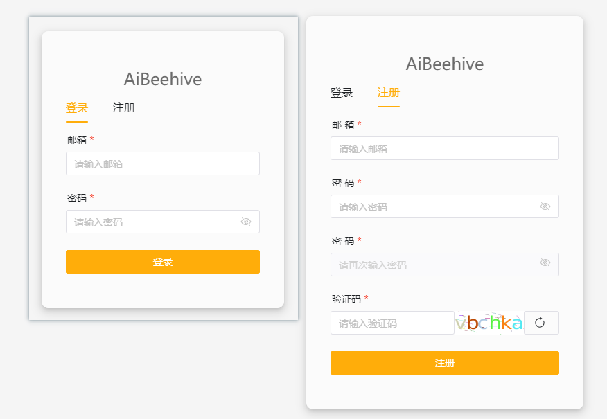

### 2.权限校验

- 增加登录和注册邮箱后缀校验，可以选择允许哪种邮箱后缀的邮箱登录

  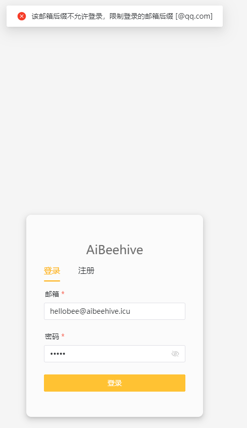

- 增加是否开启注册，未开启情况下不允许注册

  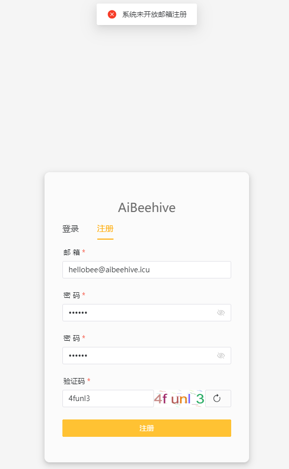

- 增加注册审核，开启后，用户注册完状态为待审核，需管理员将用户的状态改为通过才可登录

- 增加用户登录状态，包含禁止登录、待审核以及正常。禁止登录状态的用户无法登录，可以通过移除 Redis 用户 Token 强制退出。

### 3.相关参数

通过 bh_sys_param 表的 **email-registerLoginConfig** param key 实现控制

```
{
	"registerVerificationRedirectUrl": "http://localhost:1002/#/emailValidation?type=email&verifyCode=",
	"registerVerifyCodeExpireMinutes": "验证码过期时间（分钟）",
	"registerTemplateSubject": "邮件标题",
	"registerAllowSuffix": "@qq.com,*",  // 允许注册的邮箱后缀，多个用逗号分隔
	"registerEnabled": true,         // 是否开启注册
	"loginAllowSuffix": "@qq.com,*", // 允许登录的邮箱后缀，多个用逗号分隔
	"registerCheckEnabled": true // 是否开启注册审核
}
```


## 图纸管理

- 目前已经实现的图纸有 OpenAi GPT 3.5、OpenAi GPT 4、官网 ChatGPT 3.5、、官网 ChatGPT 4、OpenAi Image 绘图、Midjourney、NewBing，可能存在一些问题待修复。图纸和配置项管理目前都得手动改数据库。

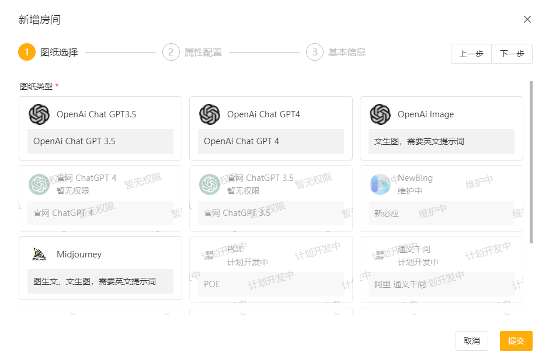

### 图纸状态

- 包含了图纸的状态，不同图纸对应前端的展示不一样，只有 published 状态的图纸才可以被使用，如果图纸状态不为 published，那么就算是已经创建好的房间也无法发送内容。用于图纸出现问题时可以即使停止使用。

### 图纸权限

- 基于 published 状态的图纸可以控制权限，分配哪些用户可以使用图纸或者全体用户都可以使用，通过 bh_cell_permission 表控制
- cell_code 表示图纸编码，type 表示权限类型，1 表示浏览权限 2 表示使用权限，权限 2 包含 1。浏览权限表示能看到图纸，使用权限表示可以使用状态为 published 的图纸。user_id 为 0 表示任意用于都拥有该权限。

| 名          | 类型     | Not Null | 注释      |
| ----------- | -------- | -------- | --------- |
| id          | bigint   | true     | 主键      |
| user_id     | int      | true     | 用户 id   |
| cell_code   | varchar  | true     | cell code |
| type        | tinyint  | true     | 类型      |
| create_time | datetime | true     | 创建时间  |
| update_time | datetime | true     | 更新时间  |

## 图纸配置项管理

- 每种图纸都拥有其配置项，配置项是在数据库维护，基本图纸的所有参数都可以存在配置项表里，初始化 SQL 中包含了已使用到的一些图纸配置项。
- 配置项表的字段有点多，每个配置项也可以配置权限，不过因为配置项有点多，所以用到情况应该很少。
- 配置项样式后续更新，房间编辑配置项功能后续更新。
- 配置项支持配置默认值、是否必填、用户是否可以使用默认值、用户是否可见、用户是否可见默认值、用户是否可修改、用户创建房间后是否可修改等等。
- 后续更新......

## 房间类型

### Midjourney

- 包含文生图、U 放大、V 变化、图生文
- 参考 https://github.com/novicezk/midjourney-proxy 项目实现

#### Imagine

文生图功能，默认从输入框发送的消息就是 imagine 指令，需要输入**英文提示词**，过程中会显示进度条。如果输入非法内容，不会有提示，此时消息相当于异常，通过定时任务重置任务状态。默认展示的图片是缩放的，减少流量传输，有需要时点击查看原图。

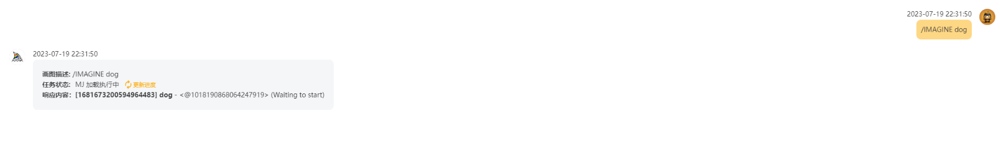

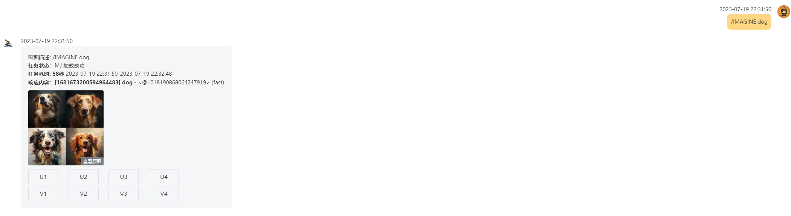

#### Upscale

放大其中一张图片，Imagine 生成的图片 Upscale 只能点一次，不能重复点击

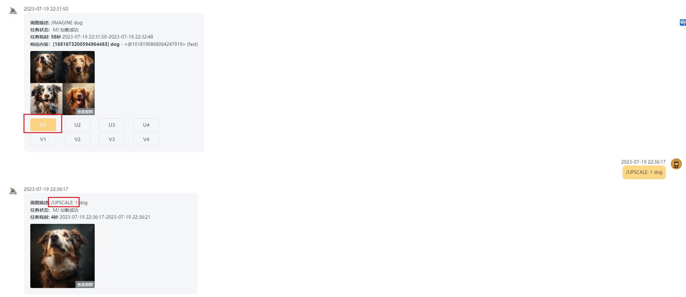

#### Variation

基于一张图片生成新的四张图片

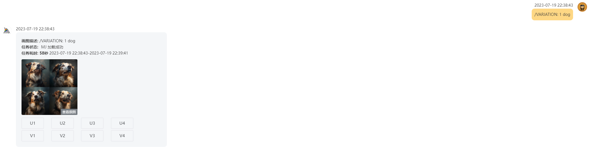

#### Describe

图生文

点击图标上传图片

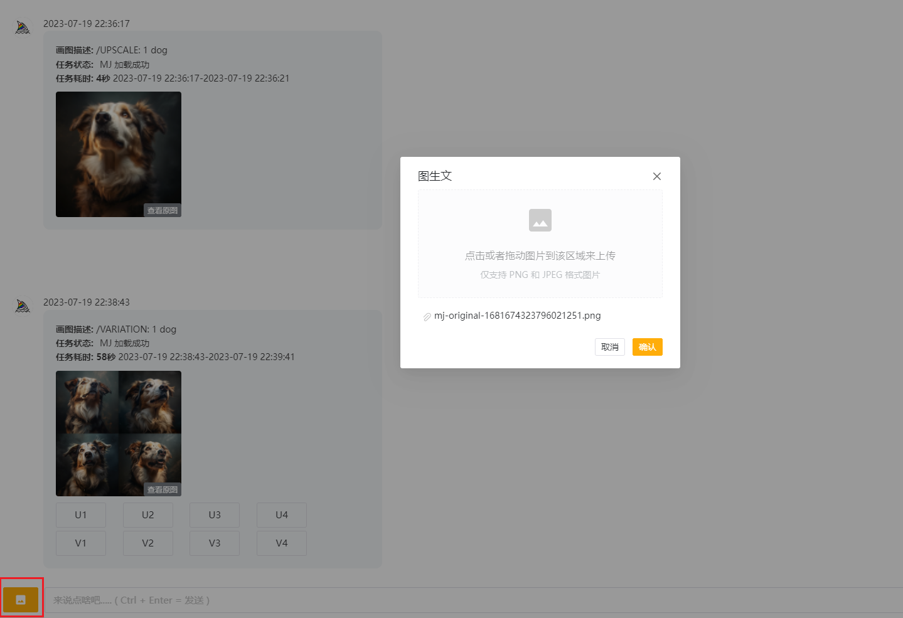

会生成四句提示语，1234 四个选项分别代表这四句提示语，点击即可自动将对应的提示语发送 Imagine 消息

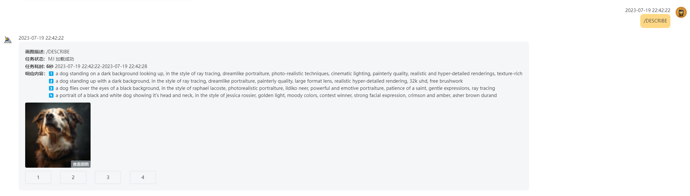

### OpenAi Image

- 图生文的功能，直接输入提示语

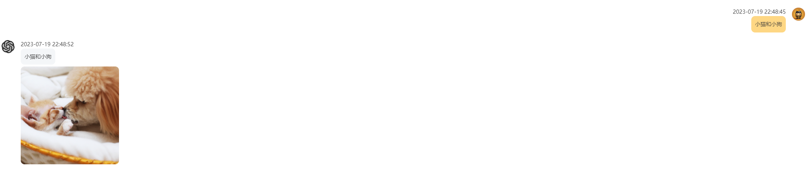

### OpenAi GPT 3.5 & 4

- 将调用 OpenAi 接口的所有参数都封装成了配置项，可以根据情况是否让用户可配置参数

  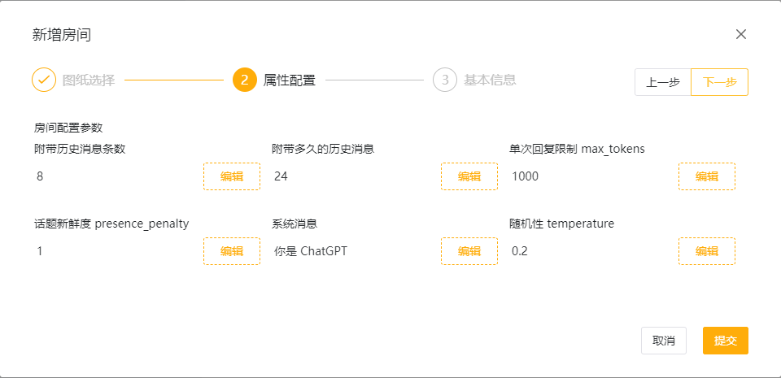

### 官网 ChatGPT

- 与原先相比增加了返回值错误的类型判断

### NewBing

- 本地可行，线上不可行，查找问题修复中

# 计划功能

- 管理端图纸管理、图纸配置项管理
- 其他图纸，文心一眼、通义千问、chatglm 等等
- 绘图的图片画廊
- 配置项样式处理，openai 的提示词商店
- 等等

# 实现方案

- 增加了 OpenAi ApiKey 轮询
- 待更新......,

# 联系方式

加群添加微信备注 Github


