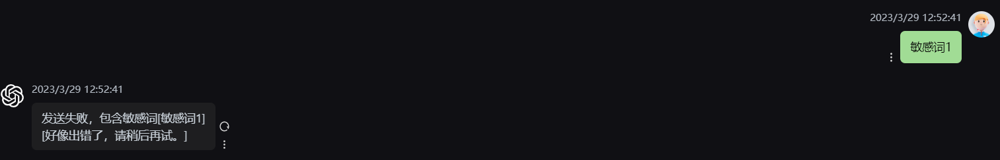

# chatgpt-web-java

# 分支 main

## 介绍 

- [Chanzhaoyu/chatgpt-web](https://github.com/Chanzhaoyu/chatgpt-web) 项目的 Java 后台
- 该分支关联项目的 [2.10.8](https://github.com/Chanzhaoyu/chatgpt-web/releases/tag/v2.10.8) 版本，在不改动前端的情况下更新后台
- [管理端开源代码](https://github.com/hncboy/chatgpt-web-admin)

## 框架

- Spring Boot 2.7.10
- JDK 17
- SpringDoc 接口文档
- MyBatis Plus
- MapStruct
- Lombok
- [Hutool](https://hutool.cn/) 
- [SaToken](https://sa-token.cc/) 权限校验
- [Grt1228 ChatGPT java sdk](https://github.com/Grt1228/chatgpt-java)

## 地址

- 接口文档：http://localhost:3002/swagger-ui.html
- 客户端：https://front.stargpt.top/ 密码：stargpt
- 管理端：https://admin.stargpt.top/ 账号密码 admin-admin

## 已实现功能

### 上下文聊天

通过 MySQL 实现聊天数据存储来实现 apiKey 方式的上下文聊天，AccessToken 默认支持上下文聊天。可以通过配置参数 limitQuestionContextCount 来限制上下问问题的数量。

数据库存储了每次聊天对话的记录，在选择上下文聊天时，通过 parentMessageId 往上递归遍历获取历史消息，将历史问题以及回答消息都发送给 GPT。


### 敏感词过滤

在项目启动时会将敏感词文件 sensitive_word_base64.txt 的数据导入到敏感词表，目前还未提供后台管理敏感词的接口，提供后这种方式可以去掉。在文件中敏感词以 base64 形式存放。并将敏感词表的数据构建到 HuTool 提供的 WordTree 类中。在发送消息调用方法判断是否属于敏感词，是的话消息发送不成功。为了兼容前端保持上下文关系，在消息内容属于敏感词的情况下会正常返回消息格式，但是带的是请求的的 conversationI 和 parentMessagId。



### 限流

分为全局限流和 ip 限流，基于内存和双端队列实现滑动窗口限流。在限流过程会异步的将数据写入的文件中，在项目重启时会读取该文件恢复限流状态。

在配置文件中配置 maxRequest、maxRequestSecond、ipMaxRequest、ipMaxRequestSecond


## 待实现功能

- GPT 接口异常信息特定封装返回
- 其他没发现的点

## 存在问题

- 在接口返回报错信息时，不会携带 conversationid 和 parentMessageId，导致前端下一次发送消息时会丢失这两个字段，丢失上下文关系。

## 管理端

### 消息记录

展示消息的列表，问题和回答各是一条消息。通过父消息 id 关联上一条消息。父消息和当前消息一定是同一个聊天室的。


### 限流记录

查看各个 ip 的限流记录，只记录在限流时间范围的限流次数。


### 聊天室管理

查看聊天室。这里的聊天室和客户端左边的对话不是同一个概念。在同一个窗口中，我们既可以选择关联上下文发送后者不关联上下文发送。如果不关联上下文发送每次发送消息都会产生一个聊天室。


### 敏感词管理

查看敏感词列表，目前只提供了查询的功能，后期可以增加管理。


## 接口

| 路径          | 功能         | 完成情况 |
| ------------- | ------------ | -------- |
| /config       | 获取聊天配置 | 已完成   |
| /chat-process | 消息处理     | 已完成   |
| /verify       | 校验密码     | 已完成   |
| /session      | 获取模型信息 | 已完成   |

## 运行

- IDEA、Dockfile

- application.yml

  ```yaml
  spring:
    datasource:
      driver-class-name: com.mysql.cj.jdbc.Driver
      username: root
      password: 123456
      url: jdbc:mysql://localhost:3309/chat?useUnicode=true&characterEncoding=utf8&serverTimezone=GMT%2B8&useSSL=false
  
  #mybatis-plus:
  #  configuration:
      # 控制台打印 SQL
  #    log-impl: org.apache.ibatis.logging.stdout.StdOutImpl
  
  chat:
    # 访问密码
    auth_secret_key: 123456
    # OpenAI API Key - https://platform.openai.com/overview
    openai_api_key: xxx
    # change this to an `accessToken` extracted from the ChatGPT site's `https://chat.openai.com/api/auth/session` response
    openai_access_token: xxx
    # OpenAI API Base URL - https://api.openai.com/，要加/后缀
    openai_api_base_url: https://api.openai.com/
    # API Model - https://platform.openai.com/docs/models apiKey 和 AccessToken mode 不一样
    openai_api_model:
    # 反向代理地址 AccessToken 时使用
  #  api_reverse_proxy: https://api.pawan.krd/backend-api/conversation
    api_reverse_proxy: https://bypass.duti.tech/api/conversation
    # 超时毫秒
    timeout_ms: 100000
    # HTTP 代理
    http_proxy_host: 127.0.0.1
    http_proxy_port: 33210
    # 管理端账号
    admin_account: admin
    # 管理端密码
    admin_password: admin
    # 管理端敏感词是否脱敏，演示用
    admin_sensitive_word_desensitized_enabled: true
    # 全局时间内最大请求次数
    maxRequest: 5
    # 全局最大请求时间间隔（秒）
    maxRequestSecond: 3600
    # ip 时间内最大请求次数
    ipMaxRequest: 10
    # ip 最大请求时间间隔（秒）
    ipMaxRequestSecond: 3600
    # 限制上下文对话的数量
    limitQuestionContextCount: 3
  ```
  
  

## Docker 

### Appliction Build & Run

```shell
 docker build -t chatgpt-web-java .
 docker run -d -p 3002:3002 chatgpt-web-java
```

- 配置参数，在环境变量 PARAMS 中配置 application yml 用到的参数，如下示例

  ```
  --spring.datasource.url=jdbc:mysql://localhost:3309/chat?useUnicode=true&characterEncoding=UTF-8&autoReconnect=true&serverTimezone=Asia/Shanghai \
               --spring.datasource.username=root \
               --spring.datasource.password=123456 \
               --chat.openai_api_key=xxx \
               --chat.openai_access_token=xxx
  ```

  

### Mysql Build & Run

MySQL容器运行，运行后可以系统可以直接连接docker MySQL容器

```shell
# 删除旧版container（如果有的话）
docker stop mysql_gpt && docker rm mysql_gpt
# 构建image
docker build -t mysql_gpt_img:latest . -f Dockerfile_mysql
# 运行container
docker run -d -p 3309:3309 \
  --name mysql_gpt \
  -v ~/mydata/mysql_dummy/data:/var/lib/mysql \
  -v  ~/mydata/mysql_dummy/conf:/etc/mysql/conf.d \
  -v ~/mydata/mysql_dummy/log:/var/log/mysql \
  mysql_gpt_img:latest
```

### Docker compose

[Docker Hub](https://hub.docker.com/repository/docker/hncboy/chatgpt-web-java)

docker-compose up -d

```yaml
version: '3'
services:
  java:
    image: hncboy/chatgpt-web-java:latest
    ports:
      - "3002:3002"
    environment:
      PARAMS: --spring.datasource.url=jdbc:mysql://localhost:3309/chat?useUnicode=true&characterEncoding=UTF-8&autoReconnect=true&serverTimezone=Asia/Shanghai \
        --spring.datasource.username=root \
        --spring.datasource.password=123456 \
        --chat.openai_api_key=xxxxx
        --chat.http_proxy_host= \
        --chat.http_proxy_port= \

```

## 表结构

- 聊天室表

| 列名                  | 数据类型         | 约束             | 说明                       |
| --------------------- |--------------| ---------------- | -------------------------- |
| id                    | BIGINT       | PRIMARY KEY      | 主键                       |
| ip                    | VARCHAR(255) |                  | ip                         |
| conversation_id       | VARCHAR(255) | UNIQUE, NULL     | 对话 id，唯一              |
| first_chat_message_id | BIGINT       | UNIQUE, NOT NULL | 第一条消息主键，唯一       |
| first_message_id      | VARCHAR(255) | UNIQUE, NOT NULL | 第一条消息 id，唯一        |
| title                 | VARCHAR(255) | NOT NULL         | 对话标题，从第一条消息截取 |
| api_type              | VARCHAR(20)  | NOT NULL         | API 类型                   |
| create_time           | DATETIME     | NOT NULL         | 创建时间                   |
| update_time           | DATETIME     | NOT NULL         | 更新时间                   |

- 聊天记录表

| 列名                       | 数据类型      | 约束        | 说明                     |
| -------------------------- | ------------- | ----------- | ------------------------ |
| id                         | BIGINT        | PRIMARY KEY | 主键                     |
| message_id                 | VARCHAR(255)  | NOT NULL    | 消息 id                  |
| parent_message_id          | VARCHAR(255)  |             | 父级消息 id              |
| parent_answer_message_id   | VARCHAR(255)  |             | 父级回答消息 id          |
| parent_question_message_id | VARCHAR(255)  |             | 父级问题消息 id          |
| context_count              | BIGINT        | NOT NULL    | 上下文数量               |
| question_context_count     | BIGINT        | NOT NULL    | 问题上下文数量           |
| message_type               | INTEGER       | NOT NULL    | 消息类型枚举             |
| chat_room_id               | BIGINT        | NOT NULL    | 聊天室 id                |
| conversation_id            | VARCHAR(255)  |             | 对话 id                  |
| api_type                   | VARCHAR(20)   | NOT NULL    | API 类型                 |
| ip                         | VARCHAR(255)  |             | ip                       |
| api_key                    | VARCHAR(255)  |             | ApiKey                   |
| content                    | VARCHAR(5000) | NOT NULL    | 消息内容                 |
| original_data              | TEXT          |             | 消息的原始请求或响应数据 |
| response_error_data        | TEXT          |             | 错误的响应数据           |
| prompt_tokens              | BIGINT        |             | 输入消息的 tokens        |
| completion_tokens          | BIGINT        |             | 输出消息的 tokens        |
| total_tokens               | BIGINT        |             | 累计 Tokens              |
| status                     | INTEGER       | NOT NULL    | 聊天记录状态             |
| is_hide                    | TINYINT       | NOT NULL    | 是否隐藏 0 否 1 是       |
| create_time                | DATETIME      | NOT NULL    | 创建时间                 |
| update_time                | DATETIME      | NOT NULL    | 更新时间                 |

- 敏感词表

| 字段名      | 数据类型     | 约束        | 描述                      |
| ----------- | ------------ | ----------- | ------------------------- |
| id          | BIGINT       | PRIMARY KEY | 主键                      |
| word        | VARCHAR(255) | NOT NULL    | 敏感词内容                |
| status      | INTEGER      | NOT NULL    | 状态，1为启用，2为停用    |
| is_deleted  | INTEGER      | NULL        | 是否删除，0为否，NULL为是 |
| create_time | DATETIME     | NOT NULL    | 创建时间                  |
| update_time | DATETIME     | NOT NULL    | 更新时间                  |

# 联系

<div style="display: flex; align-items: center; gap: 20px;">
  <div style="text-align: center">
    
    <p>631171246</p>
  </div>
</div>


# 赞助

如果觉得项目对你有帮助的，条件允许的话可以点个 Star 或者在赞助一小点。感谢支持~

<div style="display: flex; align-items: center; gap: 20px;">
  <div style="text-align: center">
    
    <p>微信支付</p>
  </div>
  <div style="text-align: center">
    
    <p>支付宝</p>
  </div>
</div>

## License

MIT © [hncboy](license)
